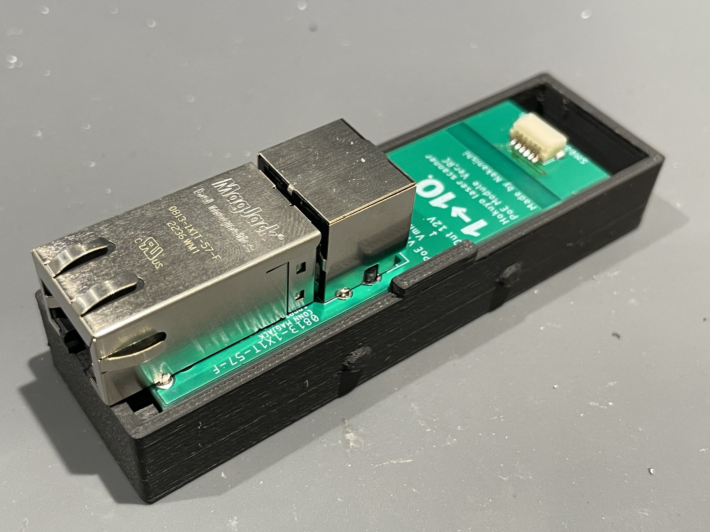

# HOKUYO LiDAR PoEAdapter

## はじめに

 HOKUYO LiDAR(USTシリーズ)のPoE化に関する資料です。
 
## フォルダ構成
| フォルダ名 | 内容 |
|:---------|:-----|
| App | 動作確認用App Installer |
| Eagle | Eagle回路図 |
| Pic | 画像 |
| stl | 基板ケースSTL |

## 動作確認用App
動作確認用Appは以下を利用しています。WindowsOSのみ対応。
* [URG Benri Lite](https://urgbenri.sourceforge.net/jp/)
## ドキュメント
* [1-10LabBlog](Link)
